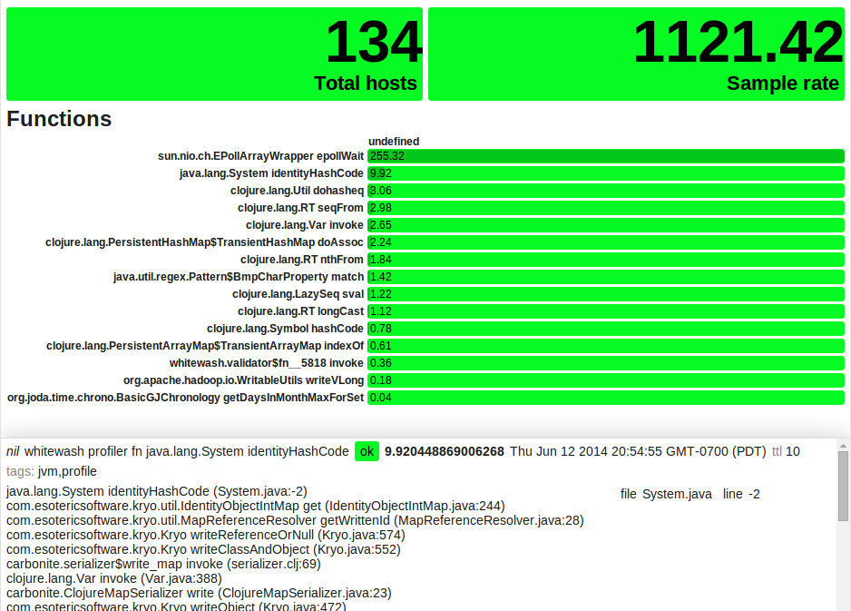

# Riemann JVM Profiler

`riemann-jvm-profiler` is a JVM agent that you can inject into any JVM
process--one written in Clojure, Java, Scala, Groovy, etc.--which sends
function-level profiler telemetry to a Riemann server for analysis,
visualization, and storage. It is designed to answer questions like "Across
this thousand-node Hadoop job, what functions consume the most CPU time, and
why?"



## Profiling your processes

Riemann-jvm-profiler requires no changes to your codebase. You'll need a
Riemann server with the websocket/HTTP server (`ws-server`) accessible from
each JVM process. The default Riemann websocket port is `5556`.

### As a library

You can add riemann-jvm-profiler artifact to your Maven or Leiningen project
via [Clojars](https://clojars.org/riemann-jvm-profiler), and somewhere in your
application startup code, invoke the profiler programmatically.

```clj
(ns my-app.bin
  (:gen-class :name my-app.bin)
  (:require [riemann.jvm-profiler :as profiler]))

(defn -main [& args]
  ; Start Riemann profiler
  (profiler/start-global!
    {:host   "my.riemann.server"
     :prefix "my app"
     :load   0.05}))
  ...
```

### As a Java agent

To profile any JVM process, build a fat jar using Leiningen.

```bash
cd riemann-jvm-profiler
lein uberjar
```

That'll spit out a file called `target/riemann-jvm-profiler-0.1.0.jar`, which
you should copy to somewhere on the classpath or filesystem on each node where
you'd like to profile a JVM process. Then add the agent to that process' java
startup options:

```bash
java -javaagent:'/var/lib/riemann-jvm-profiler.jar=prefix=my app,host=my.riemann.server' ...
```

### In a Hadoop job

Assuming you've distributed the jar to each node:

```bash
hadoop jar myjob.jar foo bar \
  -Dmapred.map.child.java.opts="'-javaagent:/var/lib/riemann-jvm-profiler.jar=host=my.riemann.server,localhost-pid?=true'" \
  -Dmapred.reduce.child.java.opts="'-javaagent:/var/lib/riemann-jvm-profiler.jar=host=my.riemann.server,localhost-pid?=true'" \
```

We're passing `localhost-pid?=true` to tell the profiler that its `host` field
should include the process ID, since Hadoop spins up more than one JVM per box.

You could theoretically use dcache to distribute the jar to each Hadoop node
and have it symlinked into some relative path prior to JVM start, but
documentation is conflicting and scarce at best, and I've never gotten that to
work with Cascading/Cascalog. SCPing the profiler uberjar to each node seems
most reliable.

## Observables

The profiler samples the stacks of all running threads as often as possible,
while consuming only `:load` fraction of a single core. Expect 10 to 100
samples per second, depending on hardware and thread count. It builds up a
statistical estimate of how much time is spent in each function, normalized to
seconds/second. Every `:dt` seconds, the profiler finds the functions which
consumed the most RUNNING thread time, finds an exemplar stacktrace for that
function which contributed the most to its runtime, and sends each function as
a single event to Riemann.

Choosing the dimensionless unit seconds/second allows the profiler to produce
meaningful results when combined across machines with similar cores and
systemic loads, but possibly disparate numbers of cores. The profiler is *not*
yet smart enough to normalize load to compensate for the other processes on a
given box; haven't figured out a reliable way to guess the CPU use of the JVM
yet. Functions on boxes with higher background load will be proportionately
over-represented; if application workload is uncorrelated with background load,
this should not be a huge problem.

## Combining events in Riemann

Combining profiler events across hosts yields a picture of the distributed system's hotspots as a whole. You can interpret the individual (and summed) metrics as being an approximate least upper bound on the number of cores engaged in running that function. Here's a small profiler-aggregation stream:

```clj
(require '[clojure.string :as str])

(defn profiler [index]
  (where (not (expired? event))
         (splitp re-matches service
                 ; Aggregate rate of samples taken
                 #".*profiler rate" (coalesce
                                      ; Total sample rate
                                      (smap folds/sum
                                            (with :host nil
                                                  index))

                                      ; Distinct number of hosts
                                      (smap folds/count
                                            (adjust [:service str/replace
                                                     "rate" "hosts"]
                                                    (with :host nil
                                                          index))))

                 ; Flatten function times across hosts, updating every 60s.
                 #".*profiler fn .+"
                 (pipe - (by :service
                             (coalesce 60
                                       (smap folds/sum
                                             (with :host nil -))))
                       ; And index the top 10.
                       (top 10 :metric
                            index
                            (with :state "expired" index))))))

; I usually have a top-level splitp to route events to various subsystems.
(let [index (index)]
 (streams
  (splitp re-find service
    ; Route profiler events to the profiler
    "#^.profiler " (profiler index)

    ...

    ; Index anything else
    index)))
```

Fire up a grid in Riemann-dash sorted by `metric`, and choose a query to view
your particular application. Here, I'm looking at the `"whitewash"` prefix,
and excluding the `epollWait` function, since it's not actually doing real
work.

```
service =~ "whitewash profiler fn %" and not service =~ "% epollWait"
```

It may be helpful to have graphs or cells to show the number of hosts
reporting, and the aggregate sample rate:

```
service = "whitewash profiler hosts"
```

```
service = "whitewash profiler rate"
```

That ought to get you started! Go forth, find hotspots, and make your code
faster. :D

## Options

Options to the agent are comma-separated key=value pairs. The common options are:

```
  :host       Riemann server hostname
  :port       Riemann HTTP port (default 5556)
  :prefix     Service prefix for distinguishing this telemetry from other apps
              (default "")
  :localhost  Override the event hostname (default: nil; calls (localhost))
  :localhost-pid?  If truthy, use pid@host as the event hostname.
  :dt         How often to send telemetry events to Riemann, in seconds
              (default 5)
  :load       Target fraction of one core's CPU time to use for profiling
              (default 0.02)"
```


## License

Copyright © 2014 Kyle Kingsbury <aphyr@aphyr.com>

Distributed under the Eclipse Public License either version 1.0 or (at
your option) any later version.
